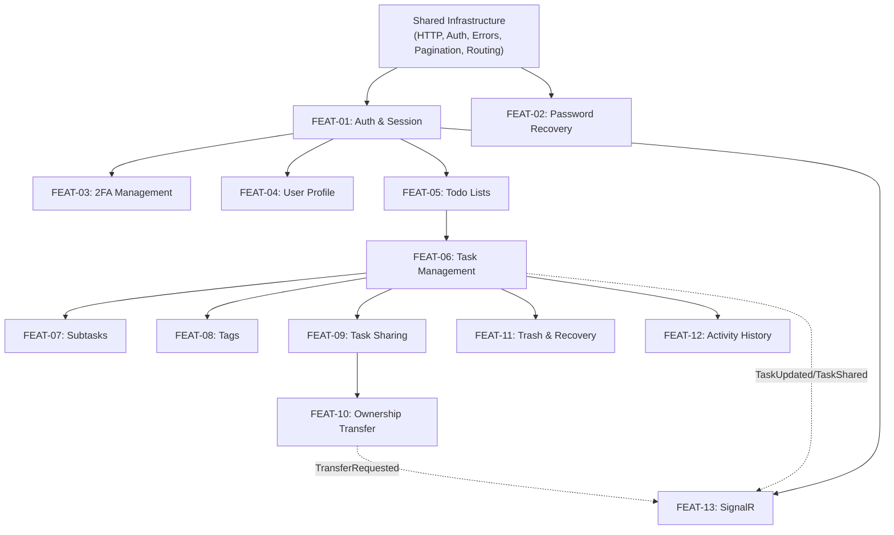

# TodoApp Mobile — Feature Breakdown (Refined)

> **Source of truth:** [`docs/spec.md`](file:///c:/Users/hasan/OneDrive/Belgeler/todo_app_mobile/docs/spec.md)  
> **Date:** 2026-10-01  
> **Revision:** 2.0 — Refined  
> **Status:** Awaiting user approval

---

## Table of Contents

1. [Revision Notes](#1-revision-notes)
2. [Feature Inventory](#2-feature-inventory)
3. [Feature Details](#3-feature-details)
4. [Shared Infrastructure](#4-shared-infrastructure)
5. [Endpoint Traceability Matrix](#5-endpoint-traceability-matrix)
6. [Overlapping & Cross-Feature Requirements](#6-overlapping--cross-feature-requirements)
7. [Dependency Graph](#7-dependency-graph)
8. [Suggested Implementation Order](#8-suggested-implementation-order)
9. [Open Questions & Ambiguities](#9-open-questions--ambiguities)
10. [Architectural Decisions Awaiting Approval](#10-architectural-decisions-awaiting-approval)

---

## 1. Revision Notes

Changes from Revision 1.0:

| Change | Rationale |
|--------|-----------|
| **Merged F06 (CRUD) + F07 (Filtering & Pagination)** into unified FEAT-06 | Browsing, searching, filtering, and CRUD are a single user experience — the task list screen. Separating them created an artificial boundary. |
| **Moved `PUT /api/Auth/change-password`** from Password Management into User Profile & Account | Changing password while logged in is a settings/profile action; Password Recovery is specifically the forgot/reset deep-link flow for unauthenticated users. |
| **Separated `POST /api/Auth/login-2fa`** — kept in FEAT-01 with cross-ref to FEAT-03 | The 2FA login challenge is part of the login flow, not 2FA management (enable/disable). |
| **Re-numbered features** FEAT-01 through FEAT-13 | Sequential numbering after merge (previous F07 removed, everything shifted). |
| **Added formal schema** to every feature | Each feature now documents: ID, Name, Purpose, Scope, Out of Scope, Endpoints, Dependencies, Business Rules. |
| **Added endpoint traceability matrix** | Every spec endpoint is mapped to exactly one primary feature with zero orphans. |
| **Added overlapping requirements section** | Cross-feature interactions are explicitly documented. |

---

## 2. Feature Inventory

| ID | Feature | Endpoint Count | Depends On |
|:---|:--------|:--------------:|:-----------|
| FEAT-01 | [Authentication & Session Lifecycle](#feat-01--authentication--session-lifecycle) | 5 | Infrastructure |
| FEAT-02 | [Password Recovery & Deep Linking](#feat-02--password-recovery--deep-linking) | 2 | Infrastructure |
| FEAT-03 | [Two-Factor Authentication Management](#feat-03--two-factor-authentication-management) | 3 | FEAT-01 |
| FEAT-04 | [User Profile & Account Management](#feat-04--user-profile--account-management) | 3 | FEAT-01 |
| FEAT-05 | [Todo Lists](#feat-05--todo-lists) | 5 | FEAT-01 |
| FEAT-06 | [Task Management](#feat-06--task-management) | 6 | FEAT-01, FEAT-05 |
| FEAT-07 | [Subtasks](#feat-07--subtasks) | 4 | FEAT-06 |
| FEAT-08 | [Tags & Categorization](#feat-08--tags--categorization) | 6 | FEAT-01, FEAT-06 |
| FEAT-09 | [Task Sharing](#feat-09--task-sharing) | 4 | FEAT-06 |
| FEAT-10 | [Ownership Transfer](#feat-10--ownership-transfer) | 5 | FEAT-06, FEAT-09 |
| FEAT-11 | [Trash & Item Recovery](#feat-11--trash--item-recovery) | 3 | FEAT-06 |
| FEAT-12 | [Task Activity History](#feat-12--task-activity-history) | 1 | FEAT-06 |
| FEAT-13 | [Real-Time Notifications (SignalR)](#feat-13--real-time-notifications-signalr) | Hub + 4 events | FEAT-01 |
| — | [Shared Infrastructure](#4-shared-infrastructure) | 2 (health) | — |

**Total: 49 REST endpoints + 1 SignalR hub (4 events) = 50 items mapped**

---

## 3. Feature Details

---

### FEAT-01 — Authentication & Session Lifecycle

* **Feature ID:** FEAT-01
* **Feature Name:** Authentication & Session Lifecycle
* **Purpose:** Provide secure user registration, login (including 2FA challenge resolution), automatic token management, and logout. This is the foundational session gate for all protected features.

* **Scope (Included Capabilities):**
  - User registration form (email + password)
  - User login form (email + password)
  - Detecting `requiresTwoFactor: true` response and presenting the 2FA code input screen
  - Submitting 2FA code via `POST /api/Auth/login-2fa` with the temporary `twoFactorToken`
  - Secure storage of JWT access token and refresh token
  - Automatic token refresh interceptor (detect 401 or proactive pre-expiry refresh)
  - Logout with server-side refresh token revocation and local credential wipe
  - Global auth state management (unauthenticated → authenticated → 2FA challenge pending)

* **Out of Scope:**
  - Enabling/disabling 2FA settings (FEAT-03)
  - Forgotten password recovery via email deep link (FEAT-02)
  - Changing password while logged in (FEAT-04)
  - User profile display (FEAT-04)

* **Related API Endpoints:**

  | Method | Path | Auth | Notes |
  |--------|------|------|-------|
  | `POST` | `/api/Auth/register` | Public | Rate limit: 3/min |
  | `POST` | `/api/Auth/login` | Public | Rate limit: 5/min; may return 2FA challenge |
  | `POST` | `/api/Auth/login-2fa` | Public | Completes login when 2FA is required |
  | `POST` | `/api/Auth/refresh` | Public | Old refresh token revoked immediately |
  | `POST` | `/api/Auth/logout` | Public | Revokes refresh token |

* **Dependencies:** Shared Infrastructure (HTTP client, secure storage, RFC 7807 error parser)

* **Relevant Business Rules:**
  - Access tokens expire in **60 minutes**
  - Refresh tokens are single-use; the old one is revoked when a new pair is issued
  - Rate limits: Register 3/min, Login 5/min → `429 Too Many Requests`
  - When `requiresTwoFactor: true`, the response fields `token`, `refreshToken`, `userId`, `email` are all `null`; `twoFactorToken` contains a temporary token
  - Password validation: at least 8 characters (exact rules unclear — see **Q1**)

* **Data Schemas:** `AuthResponse`

---

### FEAT-02 — Password Recovery & Deep Linking

* **Feature ID:** FEAT-02
* **Feature Name:** Password Recovery & Deep Linking
* **Purpose:** Allow unauthenticated users who forgot their password to request a recovery email and reset their password via a mobile deep link.

* **Scope (Included Capabilities):**
  - "Forgot Password" screen accepting email input
  - Deep link handler capturing the reset token from the incoming URL
  - URL-decoding the token from the deep link query parameter
  - "Reset Password" screen (new password input with decoded token)
  - Success feedback and navigation to login screen

* **Out of Scope:**
  - Changing password while authenticated (FEAT-04)
  - Email delivery mechanism (backend responsibility)
  - Registration or login flows (FEAT-01)

* **Related API Endpoints:**

  | Method | Path | Auth | Notes |
  |--------|------|------|-------|
  | `POST` | `/api/Auth/forgot-password` | Public | Rate limit: 2/min |
  | `POST` | `/api/Auth/reset-password` | Public | Token must be URL-decoded from deep link |

* **Dependencies:** Shared Infrastructure (Deep link routing)

* **Relevant Business Rules:**
  - Rate limit: forgot-password 2/min
  - User enumeration prevention: response is identical (`"If this email is registered..."`) whether the email exists or not
  - The reset token in the email link is URL-encoded; the app **must URL-decode** before sending to `/reset-password`

* **Data Schemas:** `{ message: string }` responses

---

### FEAT-03 — Two-Factor Authentication Management

* **Feature ID:** FEAT-03
* **Feature Name:** Two-Factor Authentication Management
* **Purpose:** Allow authenticated users to enable, verify, and disable TOTP-based two-factor authentication from their account settings.

* **Scope (Included Capabilities):**
  - Initiating 2FA setup (returns `secret` + `qrCodeUri`)
  - Rendering QR code from `otpauth://` URI for authenticator app scanning
  - Displaying manual secret key for manual entry
  - Verifying 2FA activation with a 6-digit TOTP code
  - Disabling 2FA with a 6-digit TOTP code

* **Out of Scope:**
  - Submitting 2FA code during login challenge (FEAT-01)
  - Generating TOTP codes (external authenticator app responsibility)

* **Related API Endpoints:**

  | Method | Path | Auth | Notes |
  |--------|------|------|-------|
  | `POST` | `/api/Auth/2fa/enable` | Required | Returns `secret` + `qrCodeUri` |
  | `POST` | `/api/Auth/2fa/verify` | Required | Activates 2FA after TOTP code confirmation |
  | `POST` | `/api/Auth/2fa/disable` | Required | Requires valid TOTP code |

* **Dependencies:** FEAT-01 (authenticated session required)

* **Relevant Business Rules:**
  - Enabling is a two-step handshake: `/enable` reserves the secret, `/verify` activates it. 2FA is **not active** until verify succeeds.
  - Disabling requires a valid 6-digit TOTP code to prevent unauthorized deactivation
  - `isTwoFactorEnabled` in user profile (FEAT-04) reflects the current state

* **Data Schemas:** `TwoFactorEnableResponse`, `{ message: string }`

---

### FEAT-04 — User Profile & Account Management

* **Feature ID:** FEAT-04
* **Feature Name:** User Profile & Account Management
* **Purpose:** Provide users with visibility into their account identity and security settings, the ability to change their password, and irreversible account deletion.

* **Scope (Included Capabilities):**
  - Profile/settings screen displaying: userId, email, role, isTwoFactorEnabled
  - "Change Password" form requiring current password and new password
  - Account deletion flow with destructive confirmation dialog and password verification
  - Post-deletion cleanup: clear local tokens/storage, navigate to login

* **Out of Scope:**
  - Forgotten password reset for unauthenticated users (FEAT-02)
  - 2FA enable/disable flows (FEAT-03, though status is displayed here)
  - Admin user management (no API endpoints exist)

* **Related API Endpoints:**

  | Method | Path | Auth | Notes |
  |--------|------|------|-------|
  | `GET` | `/api/Users/me` | Required | Returns userId, email, role, isTwoFactorEnabled |
  | `PUT` | `/api/Auth/change-password` | Required | Requires `currentPassword` + `newPassword` |
  | `DELETE` | `/api/Users/me` | Required | Requires password; permanent and irreversible |

* **Dependencies:** FEAT-01 (authenticated session required)

* **Relevant Business Rules:**
  - Account deletion is **permanent and irreversible** — all associated data is removed server-side
  - Account deletion requires the user's current password in the request body
  - Password change returns `204 No Content` on success
  - The `role` field (`"User"` or `"Admin"`) determines tag creation privilege (FEAT-08)

* **Data Schemas:** User profile object (inline, no named schema), `204` responses

---

### FEAT-05 — Todo Lists

* **Feature ID:** FEAT-05
* **Feature Name:** Todo Lists
* **Purpose:** Manage user-created lists (folders/categories) with optional color coding for organizing todo items.

* **Scope (Included Capabilities):**
  - Creating a new list with a required name and optional hex color code
  - Viewing all user-owned lists (unpaginated `CollectionResponse`)
  - Viewing single list details
  - Editing list name and/or color code
  - Deleting a list with user confirmation
  - Color picker UI for `colorCode` selection

* **Out of Scope:**
  - Filtering tasks by list (FEAT-06)
  - Sharing lists (API only supports task-level sharing)

* **Related API Endpoints:**

  | Method | Path | Auth | Notes |
  |--------|------|------|-------|
  | `POST` | `/api/TodoLists` | Required | `name` required, `colorCode` optional |
  | `GET` | `/api/TodoLists` | Required | `CollectionResponse<TodoListResponse>` |
  | `GET` | `/api/TodoLists/{id}` | Required | Single list detail |
  | `PUT` | `/api/TodoLists/{id}` | Required (owner) | Update name and/or color |
  | `DELETE` | `/api/TodoLists/{id}` | Required (owner) | — |

* **Dependencies:** FEAT-01 (authenticated session required)

* **Relevant Business Rules:**
  - `name`: required, max 100 characters
  - `colorCode`: optional, hex string, max 7 characters (e.g., `#FF5733`)
  - Only the list owner can edit or delete
  - **⚠️ Q3:** Cascade behavior on list deletion is unspecified — unclear what happens to associated tasks

* **Data Schemas:** `TodoListResponse`

---

### FEAT-06 — Task Management

* **Feature ID:** FEAT-06
* **Feature Name:** Task Management (CRUD, Search, Filter & Pagination)
* **Purpose:** Core task engine — create, browse, search, filter, sort, view, edit, toggle completion, and soft-delete todo items. This is the primary user-facing capability of the application.

* **Scope (Included Capabilities):**
  - **Create:** Task creation form with title (required), description, due date, priority, and optional list assignment
  - **Browse:** Paginated task list with `PaginatedResponse<TodoItemResponse>`
  - **Search:** Free-text search across title and description
  - **Filter:** Filter by `filterType` (All/OnlyMine/SharedWithMe/SharedByMe), `status`, `priority`, `todoListId`, and date range (`dueDateFrom`/`dueDateTo`)
  - **Sort:** Sort by `createdAt`, `dueDate`, `title`, or `priority` in `asc`/`desc` order
  - **Detail:** Full task detail view (includes embedded `subTasks`, `tags`, `sharedWith`)
  - **Edit:** Full update of title, description, due date, priority, list assignment (owner only)
  - **Complete/Uncomplete:** Status toggle between Open ↔ Completed (owner only)
  - **Soft Delete:** Move item to trash (owner only)

* **Out of Scope:**
  - Subtask management (FEAT-07)
  - Tag attach/detach (FEAT-08)
  - Share management (FEAT-09)
  - Ownership transfer (FEAT-10)
  - Trash browsing, restore, and permanent delete (FEAT-11)
  - Activity history (FEAT-12)

* **Related API Endpoints:**

  | Method | Path | Auth | Notes |
  |--------|------|------|-------|
  | `POST` | `/api/TodoItems` | Required | `title` required; `todoListId` must belong to user |
  | `GET` | `/api/TodoItems` | Required | 12 query parameters for filter/search/sort/pagination |
  | `GET` | `/api/TodoItems/{id}` | Required (owner or shared) | Full detail with embedded collections |
  | `PUT` | `/api/TodoItems/{id}` | Required (owner only) | Full update |
  | `PATCH` | `/api/TodoItems/{id}/complete` | Required (owner only) | Toggle Open ↔ Completed |
  | `DELETE` | `/api/TodoItems/{id}` | Required (owner only) | Soft delete → moves to trash |

  **Query Parameters for `GET /api/TodoItems`:**

  | Parameter | Type | Default | Notes |
  |-----------|------|---------|-------|
  | `filterType` | int | `0` (All) | 0=All, 1=OnlyMine, 2=SharedWithMe, 3=SharedByMe |
  | `search` | string? | — | Searches title and description |
  | `status` | int? | — | 0=Open, 1=Completed |
  | `priority` | int? | — | 0–3 |
  | `todoListId` | guid? | — | Filter by list |
  | `dueDateFrom` | datetime? | — | ISO 8601 UTC |
  | `dueDateTo` | datetime? | — | ISO 8601 UTC |
  | `sortBy` | string? | `"createdAt"` | createdAt, dueDate, title, priority |
  | `sortOrder` | string? | `"desc"` | asc, desc |
  | `page` | int | `1` | — |
  | `pageSize` | int | `20` | Max: 100 |

* **Dependencies:** FEAT-01 (auth), FEAT-05 (list selection for `todoListId`)

* **Relevant Business Rules:**
  - `title` is mandatory, max 200 characters
  - `priority` default is `1` (Medium) when not specified
  - Requests send **integer** enums; responses return **string names** (see **Q10**)
  - `PUT`, `PATCH /complete`, and `DELETE` are restricted to the **owner only**
  - Shared users can view the task (`GET`) but cannot edit, complete, or delete
  - Soft-deleted items (`isDeleted == true`) are excluded from `GET /api/TodoItems` results

* **Data Schemas:** `TodoItemResponse`, `PaginatedResponse<TodoItemResponse>`

---

### FEAT-07 — Subtasks

* **Feature ID:** FEAT-07
* **Feature Name:** Subtasks (Checklist)
* **Purpose:** Manage a checklist of subtasks within a parent todo item for fine-grained task breakdown.

* **Scope (Included Capabilities):**
  - Subtask list within the todo item detail screen
  - Adding a new subtask by title
  - Checkbox toggle for subtask completion
  - Deleting a subtask (owner only)
  - Visual subtask progress indicator (e.g., "3/5 completed")

* **Out of Scope:**
  - Subtask due dates, priorities, or nested sub-subtasks (not supported by API)
  - Assigning subtasks to specific shared users (not supported by API)

* **Related API Endpoints:**

  | Method | Path | Auth | Notes |
  |--------|------|------|-------|
  | `POST` | `/api/todoitems/{taskId}/subtasks` | Required (owner or shared) | `title` required |
  | `GET` | `/api/todoitems/{taskId}/subtasks` | Required (owner or shared) | `CollectionResponse` (no pagination) |
  | `PATCH` | `/api/subtasks/{id}/complete` | Required (owner or shared) | Toggle status |
  | `DELETE` | `/api/subtasks/{id}` | Required (owner only) | — |

* **Dependencies:** FEAT-06 (parent task must exist)

* **Relevant Business Rules:**
  - Both **owner and shared users** can create and toggle subtasks
  - Only the **owner** can delete subtasks
  - Subtask `status` toggles between `"Open"` and `"Completed"`
  - Returns unpaginated `CollectionResponse<SubTaskResponse>`

* **Data Schemas:** `SubTaskResponse`

---

### FEAT-08 — Tags & Categorization

* **Feature ID:** FEAT-08
* **Feature Name:** Tags & Categorization
* **Purpose:** Enable cross-cutting task categorization via system-wide tags that can be attached to and detached from tasks.

* **Scope (Included Capabilities):**
  - Viewing all system tags
  - Admin-only tag creation (requires `role == "Admin"`)
  - Viewing tags on a specific task
  - Attaching a tag to a task (owner only, idempotent)
  - Detaching a tag from a task (owner only; does not delete the tag from the system)
  - Browsing all tasks with a specific tag (paginated)
  - Tag chip display on task cards and detail view

* **Out of Scope:**
  - Tag deletion or renaming (no API endpoints exist)
  - Custom tag colors (not in `TagResponse` schema)

* **Related API Endpoints:**

  | Method | Path | Auth | Notes |
  |--------|------|------|-------|
  | `GET` | `/api/tags` | Required | All system tags |
  | `POST` | `/api/tags` | Required (Admin) | Create new tag |
  | `GET` | `/api/tags/{tagId}/todoitems` | Required | Paginated tasks with this tag |
  | `GET` | `/api/todoitems/{taskId}/tags` | Required (owner or shared) | Tags on a task |
  | `POST` | `/api/todoitems/{taskId}/tags/{tagId}` | Required (owner) | Attach (idempotent) |
  | `DELETE` | `/api/todoitems/{taskId}/tags/{tagId}` | Required (owner) | Detach tag |

* **Dependencies:** FEAT-01 (auth), FEAT-06 (parent task), FEAT-04 (role awareness for admin check)

* **Relevant Business Rules:**
  - Tag creation requires `Admin` role; `User` role gets `403 Forbidden`
  - Attaching an already-attached tag returns `200 OK` (idempotent)
  - Detaching does not delete the tag from the system catalog

* **Data Schemas:** `TagResponse`, `PaginatedResponse<TodoItemResponse>`

---

### FEAT-09 — Task Sharing

* **Feature ID:** FEAT-09
* **Feature Name:** Task Sharing & Member Access
* **Purpose:** Enable collaborative task access by allowing owners to share tasks with other users and collaborators to manage their participation.

* **Scope (Included Capabilities):**
  - Sharing a task with another user by email (owner only)
  - Viewing the list of shared users on a task
  - Owner removing a specific collaborator
  - Collaborator voluntarily leaving a shared task
  - Visual indicators distinguishing owned from shared tasks in lists

* **Out of Scope:**
  - Fine-grained permissions within a share (no read-only vs read-write distinction in API)
  - List-level sharing (only task-level sharing exists)
  - Transferring ownership (FEAT-10)

* **Related API Endpoints:**

  | Method | Path | Auth | Notes |
  |--------|------|------|-------|
  | `POST` | `/api/todoitems/{taskId}/shares` | Required (owner) | Share by email |
  | `GET` | `/api/todoitems/{taskId}/shares` | Required (owner or shared) | List shared users |
  | `DELETE` | `/api/todoitems/{taskId}/shares/{userId}` | Required (owner) | Remove collaborator |
  | `DELETE` | `/api/todoitems/{taskId}/shares/me` | Required (shared user) | Leave shared task |

* **Dependencies:** FEAT-06 (valid task context)

* **Relevant Business Rules:**
  - Only the **owner** can share or remove collaborators
  - Collaborators can view the task, create/toggle subtasks, and view activity — but **cannot** edit core fields, toggle task completion, or delete the task
  - **⚠️ Q4:** Duplicate share response behavior is ambiguous (spec mentions 409 globally but not per-endpoint)

* **Data Schemas:** `SharedUserResponse`

---

### FEAT-10 — Ownership Transfer

* **Feature ID:** FEAT-10
* **Feature Name:** Ownership Transfer
* **Purpose:** Facilitate formal task handover between users through an asynchronous request/accept/reject workflow.

* **Scope (Included Capabilities):**
  - Creating a transfer request by providing recipient email (owner only)
  - Viewing pending incoming transfer requests for the current user
  - Accepting a transfer request (ownership is transferred)
  - Rejecting a transfer request
  - Cancelling an outstanding request (original owner)
  - Notification badge for pending requests

* **Out of Scope:**
  - Transferring entire lists or multiple tasks at once
  - Automatic transfer without recipient consent

* **Related API Endpoints:**

  | Method | Path | Auth | Notes |
  |--------|------|------|-------|
  | `POST` | `/api/todoitems/{taskId}/transfer-requests` | Required (owner) | Send by email |
  | `GET` | `/api/transfer-requests/pending` | Required | Pending requests for current user |
  | `POST` | `/api/transfer-requests/{requestId}/accept` | Required (recipient) | Transfers ownership |
  | `POST` | `/api/transfer-requests/{requestId}/reject` | Required (recipient) | Declines |
  | `POST` | `/api/transfer-requests/{requestId}/cancel` | Required (original owner) | Cancels |

* **Dependencies:** FEAT-06 (valid task), FEAT-09 (share context interaction)

* **Relevant Business Rules:**
  - Only the current **owner** can create or cancel a transfer request
  - Only the designated **recipient** can accept or reject
  - State transitions: `Pending` → `Accepted` | `Rejected` | `Cancelled`
  - **⚠️ Q5:** Can a task be transferred to an already-shared user? What happens to the share relationship and the original owner's access post-transfer?

* **Data Schemas:** `TransferRequestResponse`

---

### FEAT-11 — Trash & Item Recovery

* **Feature ID:** FEAT-11
* **Feature Name:** Trash & Item Recovery
* **Purpose:** Provide a safety net against accidental deletion through a trash bin with restore and permanent delete capabilities.

* **Scope (Included Capabilities):**
  - Dedicated trash screen with paginated list of soft-deleted items
  - Restoring a trashed item to active status
  - Permanently deleting a trashed item with destructive confirmation
  - Visual distinction of deleted items (e.g., `deletedAt` display)

* **Out of Scope:**
  - The soft-delete action itself (`DELETE /api/TodoItems/{id}`) — initiated from FEAT-06
  - Auto-empty/expiry of trash (not documented in API)
  - Trash for lists, subtasks, or tags (no such endpoints exist)

* **Related API Endpoints:**

  | Method | Path | Auth | Notes |
  |--------|------|------|-------|
  | `GET` | `/api/TodoItems/trash` | Required | Paginated |
  | `POST` | `/api/TodoItems/{id}/restore` | Required (owner) | Restores to active |
  | `DELETE` | `/api/TodoItems/{id}/permanent` | Required (owner) | Item must be in trash |

* **Dependencies:** FEAT-06 (soft-deleted items originate here)

* **Relevant Business Rules:**
  - Only the **owner** can restore or permanently delete
  - Permanent delete requires the item to already be soft-deleted (`isDeleted == true`)
  - Restoring returns updated `TodoItemResponse` with `isDeleted: false`, `deletedAt: null`

* **Data Schemas:** `PaginatedResponse<TodoItemResponse>`, `TodoItemResponse`

---

### FEAT-12 — Task Activity History

* **Feature ID:** FEAT-12
* **Feature Name:** Task Activity History
* **Purpose:** Provide an audit trail of actions performed on a task by the owner and collaborators.

* **Scope (Included Capabilities):**
  - Activity timeline/tab in the task detail view
  - Display: actor email, action, details, timestamp
  - Chronological ordering
  - Empty state when no activity exists

* **Out of Scope:**
  - Global activity feed across all tasks (only per-task endpoint exists)
  - Filtering or searching within the activity log
  - Manual comments or entries (entries are server-generated)

* **Related API Endpoints:**

  | Method | Path | Auth | Notes |
  |--------|------|------|-------|
  | `GET` | `/api/TodoItems/{id}/activities` | Required (owner or shared) | `CollectionResponse` (no pagination) |

* **Dependencies:** FEAT-06 (task detail context)

* **Relevant Business Rules:**
  - Both **owner and shared users** can view the activity log
  - Returns unpaginated `CollectionResponse<TodoItemActivityResponse>`
  - **⚠️ Q7:** Possible `action` string values are not enumerated in the spec

* **Data Schemas:** `TodoItemActivityResponse`

---

### FEAT-13 — Real-Time Notifications (SignalR)

* **Feature ID:** FEAT-13
* **Feature Name:** Real-Time Notifications (SignalR)
* **Purpose:** Maintain live state synchronization via WebSocket push events without requiring manual refresh.

* **Scope (Included Capabilities):**
  - Establishing and maintaining SignalR connection to `/hubs/todo`
  - JWT passed as `?access_token=<token>` query parameter
  - Auto-reconnection with token refresh coordination
  - Handling 4 server-to-client events:
    1. `ReceiveNotification(title, message)` — show in-app notification
    2. `TaskShared(taskId, taskTitle)` — refresh task list, notify user
    3. `TaskUpdated(taskId)` — invalidate/refresh task data
    4. `TransferRequested(requestId, taskTitle)` — update pending transfer badge
  - Connection lifecycle binding to app foreground/background state

* **Out of Scope:**
  - Client-to-server SignalR invocations (hub is server-push only; mutations use REST)
  - Native OS push notifications when app is terminated (APNs/FCM — not documented)

* **Related API Endpoints & Events:**
  - Hub URL: `/hubs/todo`
  - Events: `ReceiveNotification`, `TaskShared`, `TaskUpdated`, `TransferRequested`

* **Dependencies:** FEAT-01 (valid access token)

* **Relevant Business Rules:**
  - WebSocket connections cannot set custom HTTP headers; token is passed as query parameter
  - On token refresh, SignalR connection must be re-established with the new token
  - `TaskUpdated` should trigger re-fetch of the affected task if it's currently visible

* **Data Schemas:** Event arguments (primitives: String)

---

## 4. Shared Infrastructure

Cross-cutting concerns to be implemented in Phase 0, before feature work begins.

### 4.1 — HTTP Client & API Layer

| Concern | Details |
|---------|---------|
| Base URL configuration | Production: `https://todoapp-api-gudhgje6bvfqg3ev.centralus-01.azurewebsites.net`, Local: `https://localhost:5240` |
| Content-Type | `application/json` for all requests |
| Auth interceptor | Attach `Authorization: Bearer <token>` to all protected requests |
| Token refresh interceptor | Detect 401 → mutex-locked refresh → retry original request |
| Rate limit handling | Handle `429` responses with user feedback and retry backoff |
| Timeout & retry | Network error handling and configurable retry strategy |

### 4.2 — Secure Token Storage

| Concern | Details |
|---------|---------|
| Storage mechanism | `flutter_secure_storage` or platform keychain |
| Stored data | Access token, refresh token, userId |
| Token expiry tracking | Proactive refresh before 60-minute expiry |
| Logout cleanup | Clear all stored tokens and user data |

### 4.3 — Error Handling (RFC 7807)

| Concern | Details |
|---------|---------|
| Response parsing | Extract `type`, `title`, `status`, `detail`, `errors` |
| Field-level errors | Map `errors` object to form field validations |
| Global error display | Snackbar/dialog for 403, 404, 409, 500 |
| Network errors | Offline detection, timeout messages |

### 4.4 — Response Wrappers & Pagination

| Concern | Details |
|---------|---------|
| `PaginatedResponse<T>` | Parse `items`, `page`, `pageSize`, `totalCount`, `totalPages`, `hasNextPage`, `hasPreviousPage` |
| `CollectionResponse<T>` | Parse `items` (unpaginated collections) |
| Infinite scroll | Automatic next-page loading with scroll position tracking |
| Page state | Current page, loading indicator, end-of-list detection |

### 4.5 — Routing & Navigation

| Concern | Details |
|---------|---------|
| Auth guard | Redirect unauthenticated users to login |
| Deep linking | Handle `reset-password?token=...` URLs (FEAT-02) |
| Shell structure | Bottom navigation or drawer (see **D2**) |

### 4.6 — State Management

| Concern | Details |
|---------|---------|
| Approach | To be decided (see **D1**) |
| Auth state | Global, drives navigation guard |
| Feature state | Per-feature state isolation |
| Caching | Network-first or offline-first (see **D3**) |

### 4.7 — SignalR Connection Service

| Concern | Details |
|---------|---------|
| Package | `signalr_netcore` or equivalent |
| Lifecycle | Connect on login, disconnect on logout |
| Reconnection | Auto-reconnect with token refresh |
| Event distribution | Route events to relevant feature state managers |

### 4.8 — Health Check

| Concern | Details |
|---------|---------|
| `GET /health` | API process liveness |
| `GET /health/ready` | Database connectivity |
| Usage | See **Q6** — likely diagnostic only |

---

## 5. Endpoint Traceability Matrix

Every endpoint and event from `docs/spec.md` mapped to its primary feature:

| # | Method | Endpoint | Feature |
|:-:|:------:|:---------|:--------|
| 1 | `POST` | `/api/Auth/register` | FEAT-01 |
| 2 | `POST` | `/api/Auth/login` | FEAT-01 |
| 3 | `POST` | `/api/Auth/login-2fa` | FEAT-01 |
| 4 | `POST` | `/api/Auth/refresh` | FEAT-01 / Infra |
| 5 | `POST` | `/api/Auth/logout` | FEAT-01 |
| 6 | `POST` | `/api/Auth/forgot-password` | FEAT-02 |
| 7 | `POST` | `/api/Auth/reset-password` | FEAT-02 |
| 8 | `PUT` | `/api/Auth/change-password` | FEAT-04 |
| 9 | `POST` | `/api/Auth/2fa/enable` | FEAT-03 |
| 10 | `POST` | `/api/Auth/2fa/verify` | FEAT-03 |
| 11 | `POST` | `/api/Auth/2fa/disable` | FEAT-03 |
| 12 | `GET` | `/api/Users/me` | FEAT-04 |
| 13 | `DELETE` | `/api/Users/me` | FEAT-04 |
| 14 | `POST` | `/api/TodoLists` | FEAT-05 |
| 15 | `GET` | `/api/TodoLists` | FEAT-05 |
| 16 | `GET` | `/api/TodoLists/{id}` | FEAT-05 |
| 17 | `PUT` | `/api/TodoLists/{id}` | FEAT-05 |
| 18 | `DELETE` | `/api/TodoLists/{id}` | FEAT-05 |
| 19 | `POST` | `/api/TodoItems` | FEAT-06 |
| 20 | `GET` | `/api/TodoItems` | FEAT-06 |
| 21 | `GET` | `/api/TodoItems/{id}` | FEAT-06 |
| 22 | `PUT` | `/api/TodoItems/{id}` | FEAT-06 |
| 23 | `PATCH` | `/api/TodoItems/{id}/complete` | FEAT-06 |
| 24 | `DELETE` | `/api/TodoItems/{id}` | FEAT-06 / FEAT-11 |
| 25 | `GET` | `/api/TodoItems/trash` | FEAT-11 |
| 26 | `POST` | `/api/TodoItems/{id}/restore` | FEAT-11 |
| 27 | `DELETE` | `/api/TodoItems/{id}/permanent` | FEAT-11 |
| 28 | `GET` | `/api/TodoItems/{id}/activities` | FEAT-12 |
| 29 | `POST` | `/api/todoitems/{taskId}/subtasks` | FEAT-07 |
| 30 | `GET` | `/api/todoitems/{taskId}/subtasks` | FEAT-07 |
| 31 | `PATCH` | `/api/subtasks/{id}/complete` | FEAT-07 |
| 32 | `DELETE` | `/api/subtasks/{id}` | FEAT-07 |
| 33 | `GET` | `/api/tags` | FEAT-08 |
| 34 | `POST` | `/api/tags` | FEAT-08 |
| 35 | `GET` | `/api/tags/{tagId}/todoitems` | FEAT-08 |
| 36 | `GET` | `/api/todoitems/{taskId}/tags` | FEAT-08 |
| 37 | `POST` | `/api/todoitems/{taskId}/tags/{tagId}` | FEAT-08 |
| 38 | `DELETE` | `/api/todoitems/{taskId}/tags/{tagId}` | FEAT-08 |
| 39 | `POST` | `/api/todoitems/{taskId}/shares` | FEAT-09 |
| 40 | `GET` | `/api/todoitems/{taskId}/shares` | FEAT-09 |
| 41 | `DELETE` | `/api/todoitems/{taskId}/shares/{userId}` | FEAT-09 |
| 42 | `DELETE` | `/api/todoitems/{taskId}/shares/me` | FEAT-09 |
| 43 | `POST` | `/api/todoitems/{taskId}/transfer-requests` | FEAT-10 |
| 44 | `GET` | `/api/transfer-requests/pending` | FEAT-10 |
| 45 | `POST` | `/api/transfer-requests/{requestId}/accept` | FEAT-10 |
| 46 | `POST` | `/api/transfer-requests/{requestId}/reject` | FEAT-10 |
| 47 | `POST` | `/api/transfer-requests/{requestId}/cancel` | FEAT-10 |
| 48 | `GET` | `/health` | Infrastructure |
| 49 | `GET` | `/health/ready` | Infrastructure |
| 50 | WS | `/hubs/todo` (4 events) | FEAT-13 |

**Coverage: 50/50 — No orphaned endpoints.**

---

## 6. Overlapping & Cross-Feature Requirements

These interactions span multiple features and must be coordinated during implementation:

| # | Interaction | Features | Resolution |
|---|-------------|----------|------------|
| 1 | **2FA login challenge vs 2FA setup** | FEAT-01, FEAT-03 | `login-2fa` is part of the login flow (FEAT-01). Enable/disable/verify live in FEAT-03. The `twoFactorToken` from login flows into `login-2fa` only. |
| 2 | **Task detail aggregated response** | FEAT-06, FEAT-07, FEAT-08, FEAT-09 | `GET /api/TodoItems/{id}` returns embedded `subTasks`, `tags`, and `sharedWith`. The detail screen renders from this payload; FEAT-07/08/09 perform mutations and refresh. |
| 3 | **Soft delete trigger vs trash management** | FEAT-06, FEAT-11 | The `DELETE /api/TodoItems/{id}` action is initiated in FEAT-06 (task list/detail); FEAT-11 manages the trash bin, restore, and permanent delete. |
| 4 | **SignalR event consumers** | FEAT-13, FEAT-06, FEAT-09, FEAT-10 | `TaskUpdated` and `TaskShared` events trigger data invalidation in FEAT-06. `TransferRequested` updates the badge in FEAT-10. FEAT-13 is the connection/dispatch layer only. |
| 5 | **User role for tag creation** | FEAT-04, FEAT-08 | `role` is exposed via `GET /api/Users/me` (FEAT-04) and consumed by FEAT-08 to conditionally show tag creation UI. |
| 6 | **2FA status in profile** | FEAT-04, FEAT-03 | `isTwoFactorEnabled` is displayed in FEAT-04 profile screen; the toggle flows into FEAT-03 enable/disable endpoints. |
| 7 | **Change password placement** | FEAT-04 (was FEAT-02 in v1.0) | Moved to FEAT-04 because it requires authentication and is a settings action; FEAT-02 is now purely the unauthenticated forgot/reset flow. |

---

## 7. Dependency Graph

---

## 8. Suggested Implementation Order

### Phase 0 — Shared Infrastructure
> HTTP client, auth interceptor, secure storage, RFC 7807 parser, pagination models, routing shell, state management setup

### Phase 1 — Authentication Foundation
> **FEAT-01** Authentication & Session Lifecycle
> **FEAT-02** Password Recovery & Deep Linking

### Phase 2 — Account & Organization
> **FEAT-03** Two-Factor Authentication Management
> **FEAT-04** User Profile & Account Management
> **FEAT-05** Todo Lists

### Phase 3 — Core Task Engine
> **FEAT-06** Task Management (CRUD, Search, Filter, Pagination)

### Phase 4 — Task Enrichment
> **FEAT-07** Subtasks
> **FEAT-08** Tags & Categorization
> **FEAT-11** Trash & Item Recovery
> **FEAT-12** Task Activity History

### Phase 5 — Collaboration & Real-Time
> **FEAT-09** Task Sharing
> **FEAT-10** Ownership Transfer
> **FEAT-13** Real-Time Notifications (SignalR)

---

## 9. Open Questions & Ambiguities

### API Specification Gaps

| # | Question | Feature | Impact |
|---|----------|---------|--------|
| Q1 | **Password validation rules**: Spec mentions "minimum 8 characters" but does not formally specify uppercase/number/special char/max length requirements. | FEAT-01, FEAT-02, FEAT-04 | Client-side form validation |
| Q2 | **Email validation rules**: Only "must be a valid email address" is stated. No length limits or domain restrictions. | FEAT-01, FEAT-09 | Form validation |
| Q3 | **`DELETE /api/TodoLists/{id}` cascade**: What happens to todo items in the deleted list? Unlinked? Trashed? Cascade deleted? | FEAT-05, FEAT-06 | Confirmation dialog wording |
| Q4 | **Duplicate share response**: What happens when sharing with an already-shared email? Global errors mention `409` for "duplicate share" but the endpoint doc is silent. | FEAT-09 | Error handling |
| Q5 | **Transfer to shared user**: Can ownership be transferred to an already-shared user? Does the share relationship change? Does the original owner retain any access? | FEAT-10 | Post-transfer state |
| Q6 | **Health check in mobile**: Should `/health` and `/health/ready` be used for connectivity checks, or are they for infrastructure monitoring only? | Infrastructure | App startup behavior |
| Q7 | **Activity log action values**: The `action` field in `TodoItemActivityResponse` is a string, but possible values are not enumerated. | FEAT-12 | UI display, localization |
| Q8 | **Rate limit response format**: Does `429` follow RFC 7807? Is a `Retry-After` header included? | Infrastructure | Retry logic |
| Q9 | **Offline behavior**: The spec is purely server-side. Should the mobile app support offline mode? | Infrastructure | Architecture scope |
| Q10 | **Enum serialization**: Requests use integers (`priority: 2`), responses return strings (`"High"`). Is this consistent across all endpoints? | FEAT-06 | Serialization logic |

> ⚠️ **None of these ambiguities have been silently resolved.** Each is preserved for explicit clarification before the relevant feature specification is written.

---

## 10. Architectural Decisions Awaiting Approval

| # | Decision | Options | Notes |
|---|----------|---------|-------|
| D1 | **State management** | Bloc / Riverpod / Provider | Affects all feature implementations |
| D2 | **Navigation pattern** | Bottom navigation bar / Drawer / Tabs | Affects shell architecture |
| D3 | **Offline support** | Network-first (no cache) / Network-first with read cache / Offline-first | See Q9 |
| D4 | **Background notifications** | SignalR only / SignalR + FCM/APNs | When app is terminated |
| D5 | **Design system** | Material 3 defaults / Custom themed Material 3 | Affects all UI |
| D6 | **Localization** | Turkish only / Turkish + English | Affects string management |
| D7 | **Minimum platform versions** | Android SDK min? iOS min? | Affects package compatibility |

---

*This document is a pre-implementation analysis. No individual feature specifications, plans, or code will be generated until this breakdown is reviewed and approved.*
