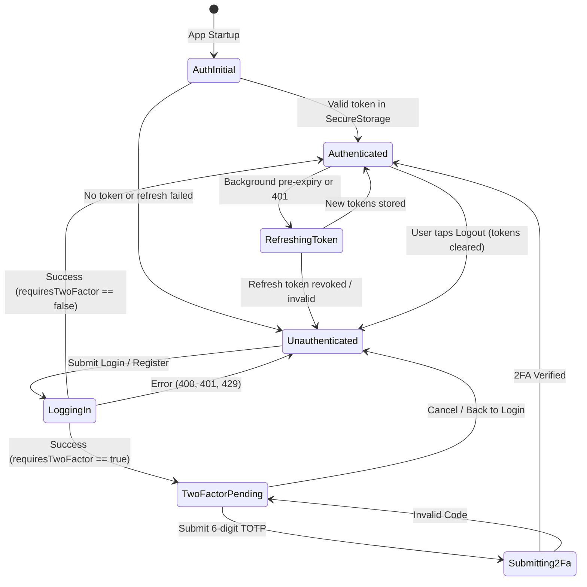

# Data Model: Authentication & Session Lifecycle

**Feature**: FEAT-01 (Authentication & Session Lifecycle)  
**Date**: 2026-10-02  
**Status**: Completed  

---

## 1. Domain Entities

### `AuthSession`
Represents an active, authenticated user session on the mobile device.

| Field | Type | Nullable | Description |
|:---|:---|:---:|:---|
| `userId` | `String` (UUID) | No | Unique identifier of the authenticated user |
| `email` | `String` | No | User's email address |
| `accessToken` | `String` (JWT) | No | Bearer token used for authenticating API requests (60 min expiry) |
| `refreshToken` | `String` | No | Single-use token used to renew the access token |
| `expiresAt` | `DateTime` | No | Estimated expiration timestamp (issuedAt + 60 minutes) |

---

### `TwoFactorChallenge`
Represents an intermediate state where primary credentials succeeded, but TOTP verification is required to complete authentication.

| Field | Type | Nullable | Description |
|:---|:---|:---:|:---|
| `twoFactorToken` | `String` | No | Temporary token provided by backend to authorize `POST /api/Auth/login-2fa` |
| `email` | `String` | No | User email from login attempt for display purposes |

---

## 2. Data Transfer Objects (DTOs) & Request/Response Models

### 2.1 `RegisterRequest`
Payload sent to `POST /api/Auth/register`.

```dart
class RegisterRequest {
  final String email;
  final String password;
}
```

**Client-Side Validation Rules:**
- `email`: Required, valid email format (RFC 5322 regex).
- `password`: Required, minimum 8 characters, at least 1 uppercase letter, at least 1 number, at least 1 special character (`[!@#\$%^&*(),.?":{}|<>]`).

---

### 2.2 `LoginRequest`
Payload sent to `POST /api/Auth/login`.

```dart
class LoginRequest {
  final String email;
  final String password;
}
```

**Client-Side Validation Rules:**
- `email`: Required, valid email format.
- `password`: Required, non-empty.

---

### 2.3 `Login2FaRequest`
Payload sent to `POST /api/Auth/login-2fa`.

```dart
class Login2FaRequest {
  final String twoFactorToken;
  final String code; // 6-digit TOTP code
}
```

**Client-Side Validation Rules:**
- `twoFactorToken`: Required, non-empty string.
- `code`: Required, exactly 6 numeric digits (`r'^\d{6}$'`).

---

### 2.4 `RefreshTokenRequest`
Payload sent to `POST /api/Auth/refresh`.

```dart
class RefreshTokenRequest {
  final String refreshToken;
}
```

---

### 2.5 `LogoutRequest`
Payload sent to `POST /api/Auth/logout`.

```dart
class LogoutRequest {
  final String refreshToken;
}
```

---

### 2.6 `AuthResponseDto`
Unified backend response from `register`, `login`, `login-2fa`, and `refresh`.

```json
{
  "userId": "4e8d5ea2-3c12-4f89-8d7b-123456789abc",
  "email": "user@example.com",
  "token": "<jwt>",
  "refreshToken": "<refresh_token>",
  "requiresTwoFactor": false,
  "twoFactorToken": null
}
```

**Mapping Logic to Domain:**
- If `requiresTwoFactor == true`: Map to `TwoFactorChallenge(twoFactorToken: dto.twoFactorToken!, email: requestEmail)`.
- If `requiresTwoFactor == false`: Map to `AuthSession(userId: dto.userId!, email: dto.email!, accessToken: dto.token!, refreshToken: dto.refreshToken!, expiresAt: now + 55 min)`. *(Note: 55 minutes is used to trigger refresh 5 minutes before actual 60 min expiration).*

---

### 2.7 `ProblemDetailsDto` (RFC 7807 Error Response)

```json
{
  "type": "https://tools.ietf.org/html/rfc7231#section-6.5.1",
  "title": "Validation Error",
  "status": 400,
  "detail": "One or more validation errors occurred.",
  "errors": {
    "email": ["Must be a valid email address."],
    "password": ["Minimum 8 characters required."]
  }
}
```

---

## 3. State Machine & Lifecycle Transitions



---

## 4. Secure Storage Keys

| Key | Storage Target | Value Type | Description |
|:---|:---|:---|:---|
| `auth_access_token` | Secure Storage (Keychain/KeyStore) | String (JWT) | Bearer access token |
| `auth_refresh_token` | Secure Storage (Keychain/KeyStore) | String | Refresh token |
| `auth_user_id` | Secure Storage (Keychain/KeyStore) | String (UUID) | User unique identifier |
| `auth_email` | Secure Storage (Keychain/KeyStore) | String | User email address |
| `auth_token_expires_at` | Secure Storage | String (ISO 8601) | Timestamp for proactive refresh |
